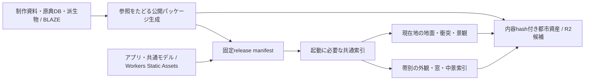

# 三帯都市の本番配信

最新の停止位置・Quest検証・toming-serverへのデータ移設・再開手順は
[開発引き継ぎ](development-handoff.md) を参照。以下の日時付き記録とBLAZEパスは当時の記録。

2026-09-25、tomingは次の開発について、交通追加より本番デプロイに向けた膨大なデータの扱いを検討したいと発言。
続く「いいね、それをゴールにしよう」で、下記の公開候補の作成を採用。2026-09-26、本人の「wrangler login 済！」を受けて外部準備を再開。
R2バケット・配信ドメイン・CORSを作成済み。都市71,604件をR2へ転送し、CDNルール4件と候補Workerを公開済み。公開URLでのPC/VR・HTTP・起動・連続移動の受入も完了。
公開候補のゴールは達成。本番 `spinward.toming.app` の切替は次の段階で、まだ実施していない。

**2026-09-26 実機確認による再評価:** tomingのQuest 3Sでは、Enter VR後に景色が一瞬出てブラウザが終了した。
上のVR合格はPC上のplaywright-webxrエミュレーションであり、実機合格ではない。
本番切替を進める前に、この開始クラッシュの解消を確認する。まずQuestのXR解像度を0.7倍、MSAAを無効、
入場前のDPRを上限1とする暫定版を候補へ用意した。実機の原因確定・解消判定は未完了。
詳細: [Quest 3S開始不具合](../qa/plateau/quest-3s-entry-20260926.md)。

## 順次進めるマイルストーン（2026-09-26）

tomingの「前述のマイルストーンを順次ゴールに定めて進めて」を受け、次の順で実施する。
アプリには未完了の本番配信ゴールが既にあり、新しい個別ゴールの登録は拒否された。
既存ゴールを未達のまま完了へ変えず、以下で個別の到達点を管理する。

| 段階 | 到達点・完了条件 | 状態 |
| --- | --- | --- |
| 1. ローカル公開候補の受入 | 圧縮releaseを固定し、初回・再訪・連続利用、通常/低速回線の飛行と着地、三帯反復の常駐上限、PC/VR/障害復帰を確認。失敗は原因と処置を記録 | 2026-09-26完了（下記範囲） |
| 2. 配信環境と候補公開 | 固定された都市releaseとアプリの公開手順・設定・費用を用意。認証と公開条件を満たして候補URLへ配信し、実CDNのHTTP/cache/CORS・更新中断/再開・切り戻し・PC/VRを確認 | 2026-09-26完了。全都市再実行0件転送、実CDNの18項目・3地点起動・通常/低速飛行・三帯12訪問が合格 |
| 3. 本番切替 | 検証済み候補を本番へ切り替え、利用者と同じURLで版・到着・描画を確認。旧版への復旧手順を保持 | 未着手 |

実HMD未検証は明示する。候補公開・資源作成・本番切替の承認が必要な時点では、完了したローカル成果と具体的な変更を提示する。

### 第1段階の追加受入結果

- 公開パッケージ自身を5321でHTTPS配信し、同じ永続Chromeの中で初回→全景読み込み→再訪→次地点と進む測定を完走。
  渋谷8.634秒/8.343MB、大宮8.353秒/8.104MB、東京8.643秒/8.388MB、再訪は全地点1.384〜1.396秒。
  同じChromeで初回だけを3地点続ける対照も8.384〜8.655秒。全件10MB/10秒以下、page errors0。
  過去の11.7/17.1秒は今回再現しなかったが、その原因を特定したとは扱わない。
- 大宮の120秒飛行/旋回/着地を10Mbps・100msと2Mbps・200msで各1回実施。
  各3回地上復帰、最大相対速度121.1/120.5m/s、地表から約306/304m、衝突タイル追加38/36件。
  どちらも停止0、失敗0、衝突常駐peak8.34/7.73MB。起動はLANで済ませ、その後に回線制限を適用した。
- 同じChromeでPlacesの東京→新宿→大宮→渋谷を3周（12回）、2Mbps・200msで検査。
  全到着の方位/軸方向座標・原典地面への描画接触を確認。最初の未訪問地点4.32〜6.98秒、2周目以降0.13〜0.51秒。
  衝突peak15.45MB、共有配列8.387MB、帯ごとの近景6.280MB/遠景5.976MB、全て各上限以内。JS/HTTP errors0。
  3周の検査であり、GPU/プロセス全体のメモリ上限や長時間リーク不在を保証しない。
- 前段のPC/VR/昼夜12項目・障害復帰4項目の合格を引き継ぐ。選別packageの114ファイルは検証済みbuildと全バイト一致。
  型検査とmanifest付きproduction build、パッケージ化/公開再開の11 Pythonテスト成功。

証跡: `qa/plateau/metro-release-acceptance-20260926.json`、`qa/plateau/metro-app-package-20260926.json`。
BLAZEの `acceptance-full-sequential-v1`、`acceptance-cold-sequential-v1`、`acceptance-endurance-{normal,slow}-v1`、`acceptance-visits-slow-v3`。
Places検査の初期版は身体の接地前の計測と、移動先でなく初期選択ラベルを読む誤りで失敗した。
v3は身体の接地待ちと実座標照合を分けて修正し、製品側の座標・準備状態は変更していない。

## 実装した構成

Spinwardの共通物理・身体・VR・UIは維持する。標準イズマ（半径3.2km、長さ40km、三帯）ではPLATEAUの都市を選択し、
Playground・Cooper・Elysiumと実データの寸法条件から外れた環境では従来のプロシージャル都市を使う。
PLATEAUと旧生成都市を重ねて描画しない。実データの建物にも共通部品・用途レシピ・窓シェーダを適用する。
従来都市の交通・室内施設を全て実データ側へ移植済みという意味ではない。
コードの切り替えは現状Cityscape内にあり、完全な独立プラグイン化はこの配信作業の対象外。



| 配布対象 | 現在の値 | 性質 |
| --- | ---: | --- |
| 都市release | 71,604ファイル / 2,875,904,387 bytes | 全ファイルSHA-256・参照閉包検査済み |
| 起動用core索引 | 2,361,223 bytes（gzip） | 三帯共通の必須情報 |
| 外観・窓の帯別索引 | east 646,366 / central 663,838 / west 667,334 bytes | 近づいた帯だけ取得 |
| 共有モデル・サイト素材 | 107ファイル / 18,461,583 bytes | 明示allowlist、GLTF外部画像も検査 |
| アプリ候補v7 | 114ファイル / 22,730,182 bytes | アプリ＋上記素材。v8で障害復帰を修正、最終容量は再集計する |

都市の形状・座標を量子化して削った成果ではない。形状の保存バイト列は維持し、参照の重複排除・索引分割・取得順序を変更した。
旧public全体（約2.9GB）の無条件コピーをやめ、共有モデルを内容hash付きの名前空間へまとめた。
研究用の旧 `preset=three-bands` / `landscape=authored` は通常の開発ビルドに残す。
本番releaseビルドで旧URLを開いた場合は現行の統合アプリへ入り、未配信の旧資料を要求しない。

実装の入口:

- `assets/plateau/package_metro_release.py`: 実参照だけの都市パッケージ生成。途中再開・内容重複排除、原典のパス逸脱を拒否。
- `assets/plateau/package_metro_shared.py`: 共有モデルの選別、外部GLTF画像の閉包検査、固定prefixとHTTP headersの生成。
- `assets/plateau/package_metro_app.py`: Vite manifestの到達可能なchunk・明示参照Worker・checksum済み共有素材だけを新規 `public/` へ選別。
  外付け媒体の `._*`・非参照JS・sourcemap・制作DBを含めず、`.assetsignore` でも後から作られる管理ファイルを除外する。
- `assets/plateau/publish_metro_release.py`: 全hash・参照の検査、dry-run、S3/R2差分アップロード。アップロードは明示 `--apply` のみ。
- `src/worlds/plateau/data-source.js`: 配信root、固定release、core/帯別索引のchecksum、gzip展開。
- `vite.metro.config.mjs`: アプリと共有モデルだけをbuild。都市データ本体はbuild機に不要。
- `qa/plateau/metro-release.vite.config.mjs`: inventory許可リストだけを返すローカルHTTPS配信。

## 更新と復旧の実装契約

`releases/<sha256>.json` をアプリのbuildで固定する。root manifestの内容hash、coreと帯別索引のhash・frameを照合する。
`latest.json` を移動ごとに読み替えない。都市objectは `objects/<prefix>/<sha256>.<ext>` に置き、上書きしない。
ファイル本文を検査する対象は公開inventoryのみ。作業ディレクトリにある旧版・失敗生成物・原典はupload対象にならない。

S3 uploadはオブジェクトごとにHEADで既存hash/サイズ/headersを確認し、未存在だけ条件付きPUT（`If-None-Match: *`、Content-MD5）する。
PUT後もHEAD照合する。最大16並列（既定8）、全参照の完了後にroot manifestを最後に送る。失敗した新releaseは有効化されず、再実行で既送信物を再利用する。
旧app版とその固定releaseを保持して切り戻す。データ削除・GC・上書き機能は実装していない。
fake storeの故障注入で「途中失敗→再開→旧版維持→pinを戻す」を検査済み。実R2での検査とは区別する。

HTTPでは `.bin.gz` / `.json.gz` を既に圧縮した不透明オブジェクトとして配信し、`Content-Encoding` を付けない。
CDNも画像変換・自動圧縮で本文を変えない。JSONのcore/帯別索引は保存バイト列のhashを先に照合し、それから一度だけ展開する。
形状バイナリの全件checksumはパッケージ検査で行い、クライアントが毎タイルSHA-256計算する方式ではない。

起動時は現在地の地面・衝突・空を囲む景観を優先し、操作可能になるまで遠隔帯の詳細と夜景の取得を待つ。
取得失敗は最大3回の間隔付き再試行。その後はPlacesで目的地を選び直すと、衝突と必要な描画タイル・夜景・帯別索引を再試行できる。
必須の地面が欠けたまま移動を許可しない。外観や夜景だけの失敗は歩行を止めない。

## 検証記録と現時点の制限

2026-09-26の追加実装: 公開候補を確定する前に[無劣化圧縮](metro-compression.md)を実施。
32標本で形状のMeshopt+gzipなどの可逆圧縮を比較した後、全41,048バイナリへ変換/復号照合を実施。
新release `ce65ac50fdc0bb7e8ddc3c7ce8de3f9243c5d2129ecefd4ce8a304574fa3c8f4` は2.371GB（17.6%削減）。
圧縮版は地点ごとに新しいChromeを使った比較で渋谷8.649秒/8.344MB、大宮8.398秒/8.105MB、東京8.760秒/8.388MB。
渋谷の再訪1.389秒。関連62単体テスト、障害復帰4項目、PC/VR/昼夜12項目が成功。
高速上昇飛行で10Mbps/2Mbpsとも操作停止・ストリーム失敗0。低空衝突タイルを連続して跨ぐ試験ではない。
独立した夜景/ステレオ画像比較でも明瞭な外観退行なし。詳細条件・未保証範囲は圧縮記録に記載。
下記v8までの記録は比較用に保持する。最新の値と条件は圧縮記録を参照。

証跡root: `/Volumes/BLAZE/Spinward/inland-b-20260924/production-20260925`。
通常版 `nightscape-20260925/build-v14` の5318と比較用v8の5319を保持し、圧縮候補 `build-meshopt-v1` を5320でHTTPS配信している。

- `data-v1/inventory.json` / `dry-run-v2.json`: 全71,604ファイルのhash・サイズ・参照検査、欠損0。初回upload想定2,875,904,387 bytes。
- `shared-v1/shared-index.json`: 共通モデル固定prefix `ad58abe2721b4b5409a1e5813018e8ab469220a1046f0092d304aa8668f9030b`。
- 都市release pin: `releases/c5cbf79810bd55169494049072c3f49a071315f7edf5c83dc4115c8e198f27ad.json`。
- `wan-v3`: 到着地点を実座標まで検査した測定。渋谷9.67秒/9.92MB、大宮9.37秒/9.65MB、東京9.85秒/10.21MB。
  東京は10MBを超えたため未達。同版再訪は1.41〜1.45秒、196〜219bytes。512MiBの永続Chromeキャッシュで通常再訪。
- v4で都市には表示しない展望デッキ490KBの先行取得を除去。渋谷9.32秒/9.43MB、大宮9.15秒/9.16MB。
  途中の画像保存失敗により三地点一括検証未完了。最終候補を再測定する。
- v5は再試行が夜景を先行取得する回帰を検出し不採用。v7以降で初期到着と再試行を区別。
- `faults-v8`: HTTP契約、破損coreからReloadで復帰、外観・夜景の503から復帰、必須衝突の安全停止→Places再試行の4項目pass（23.4秒）。
  v7で見つかった「衝突だけ復旧して描画タイルが再取得されない」不具合も修正。単体で夜景・地面の再試行11 tests pass。
- `unit-v7.log`: 1,285 pass / 8 timeout。assertion不一致ではなく全て時間上限超過。該当ファイルの単独再検査を進行中。
- `unit-timeouts-recheck.log`: 該当6ファイルは53 pass / 1 timeout。残件は既存の `motorway parapets leave each ordinary road approach open` が約22秒で既定5秒を超えること。
- `wan-v8`: 渋谷9.29秒/9.42MB、再訪1.38秒/157bytes。大宮の初回9.29秒/9.16MBは記録したが、再訪で応答停止したため全体合格ではない。
  小さなファイルのcurl直取得とブラウザfetchは正常。`calibration/network-calibration.json` に回線制御方式の対照を記録。
  現行のCDP `emulateNetworkConditionsByRule` による `wan-v8-rule` は大宮初回9.159秒/9,156,436bytes、再訪1.414秒/157bytes、errors0。
  旧方式の停止原因は未確定。方式差を記録した三地点まとめの再検証を行う。
- `wan-v8-rule-three`: 三地点測定を完走。渋谷9.307秒/9,424,139bytes、大宮11.665秒/9,156,281bytes、東京17.119秒/9,713,599bytes。
  転送10MBは全て合格、10秒は大宮・東京で未達。再訪2.664/5.916/6.198秒、各157bytes、page errors0。
  単独測定との差は未解決。速度目標の達成扱いにしない。
- 独立した画像検証者が `wan-v8/omiya-settled.png` と従来v14の大宮夜景を比較。共通視野で近景の外観・灯具・光・遠景の明確な欠落なし。
  水平画角を補正した建物の平均RGB絶対差1.27/255、地表照明0.94/255。駅舎の個別同定・画面外の三帯全体・動的挙動はこの比較だけでは保証しない。

計測は実Metal GPU（Apple M1 Pro）、Chrome、CDP下り10Mbps/100ms、Quest設定。完了要求だけでなく操作開始時点のin-flight実転送も数える。
v1/v2はJSONキー順の違いで一部の名前付き到着がfallbackになっていたため、三地点の合否に使わない。比較は修正後のv3以降。
実CDN・実WAN・実HMDの確認ではない。最終ビルドの三地点予算・高速移動・両眼/手首UI・四環境往復の合否が揃うまでは公開候補完成としない。

## ローカル再現

Python3.12、Bun1.3.10、lockfile通りのnpm依存を使用。作業パスは例示で、既存の制作原本を出力先にしない。

```sh
export METRO_SOURCE=/Volumes/BLAZE/Spinward/inland-b-20260924/derived
export METRO_STAGE=/Volumes/BLAZE/Spinward/inland-b-20260924/production-20260925
python3 assets/plateau/package_metro_release.py --source "$METRO_SOURCE" --output "$METRO_STAGE/data-v1"
python3 assets/plateau/publish_metro_release.py --package "$METRO_STAGE/data-v1" --report "$METRO_STAGE/dry-run.json"
# Shared output must be new: the staging tool deliberately refuses directory merging.
python3 assets/plateau/package_metro_shared.py --source "$PWD/public" --output "$METRO_STAGE/shared-new"
```

`inventory.json` のreleaseを読み、明示的にbuildへ渡す。上記shared-newの代わりに検査済みshared-v1を再利用できる。

```sh
export SPINWARD_SHARED_PACKAGE="$METRO_STAGE/shared-v1"
export VITE_METRO_RELEASE="$(python3 -c 'import json,os; print(json.load(open(os.environ["METRO_STAGE"]+"/data-v1/inventory.json"))["release"])')"
export VITE_METRO_DATA_ROOT=/metro-data/
export SPINWARD_METRO_OUTPUT="$METRO_STAGE/build-new"
bun run build --config vite.metro.config.mjs
export SPINWARD_RELEASE_PACKAGE="$METRO_STAGE/data-v1"
# Check that the chosen port is free before starting a strict-port preview.
bunx vite preview --config qa/plateau/metro-release.vite.config.mjs --port 5319 --strictPort
```

```sh
export SPINWARD_METRO_URL=https://127.0.0.1:5319
export SPINWARD_METRO_EVIDENCE="$METRO_STAGE/wan-new"
SPINWARD_RELEASE_ENFORCE_BUDGETS=1 node qa/plateau/metro-release-profile.mjs
SPINWARD_METRO_EVIDENCE="$METRO_STAGE/faults-new" bunx playwright test --config qa/plateau/metro-release.playwright.config.mjs metro-release.xr.mjs
```

本番では `VITE_METRO_DATA_ROOT` を承認されたHTTPSのCDN rootへ変更してbuildし、その実URLで再検証する。
アプリbuildに都市の2.88GBをコピーしない。CIからBLAZE・原典DBを参照させる必要もない。

## 公開前に残す承認と作業

候補案: R2 Standard bucket `spinward-metro`、データドメイン `data.spinward.toming.app`。
2026-09-26作成済み。既存Worker `spinward` のOGP処理・`/metric`・Analyticsを維持し、都市配信はR2直結CDNへ分離する。
先に候補URLだけで検証し、現在の本番ドメインの切替は別の最終判断とする。

必要な設定: GET/HEADのCORS、`Timing-Allow-Origin`、正しいContent-Type、不変Cache-Control、JSON/bin/gzも含むCDNキャッシュルール、
本文を変換しない圧縮設定、r2.devの本番利用を避けること。CORSの公開読取は認証付きのデータ公開ではない。
アップローダーのS3認証は対象bucketだけのObject Read/Writeへ限定し、資格情報をrepo・ログ・公開manifestに残さない。

同日の最初の `wrangler whoami` はOAuth期限切れ・refresh失敗。その後、具体的な候補公開案と費用を提示し、本人が再ログイン。
更新されたOAuthでR2・Workerの操作は通ったが、ゾーンのDNS/Rulesetsとトークン管理APIは403だった。
再ログイン要求を繰り返さず、必要なS3バケット専用認証と、CDNルール編集用の管理画面ログインを追加で依頼した。

### 2026-09-26の具体的な候補公開案

- 都市: R2 Standard bucket `spinward-metro`、custom domain `data.spinward.toming.app`。
  作成済み、location hintはapac、TLS 1.2以上。既存バケット一覧に同名なし、作成前のDNSはNXDOMAIN。
  `toming.app` が同じaccountのactive zoneであることをAPIで確認し、既存資源を上書きしていない。
- アプリ: Worker `spinward-metro-candidate` のworkers.dev URLで検査する。
  `wrangler.metro-candidate.jsonc` は本番route/domainとAnalytics datasetの指定を持たない。
  Worker本体は本番と共通で、候補では `/metric` を受けても集計先を作らない。本番configのOGP・Analyticsは保持する。
  account subdomainは `toming` とAPIで確認済み。候補URLは `https://spinward-metro-candidate.toming.workers.dev/`。
  当初は未公開だったが、同日の後続作業で公開・読み戻し済み。公開前の本番versionは `22ddddde-89bb-4369-9c2c-ee0c1bcacff6`。
- 都市は新releaseのみなら71,604 objects / 2,370,602,829 bytes。
  旧データreleaseも保持する場合、内容hashの重複を除いた合計は103,456 objects / 4,508,805,886 bytes。
  旧版を既に持つ場合の追加は31,852 objects / 1,632,901,499 bytes（39,752 objectsを再利用）。
- アプリ公開対象は115ファイル / 22,779,767 bytes（`.assetsignore`・`_headers`を含む）。
  ローカルroot用のpackage hashは `3dc3955b9686e9cec6db6be8b95e86a4b820b4ff6c082e14eac55c8a71844b35`。
  raw buildには外付け媒体の管理ファイルが混ざることをdry-runで検出したため、以後 `build/` を直接deployしない。
  共有素材のhash、chunkの存在、worker、公開前後の同一バイト列を検査してから `package/public/` を渡す。

HTTP設定案:

1. R2公開読み取りのCORSは `assets/plateau/r2-public-cors.json`（GET/HEAD、origin `*`、検査用headersをExpose）。
   公開都市データであり、CORSはアクセス制限や匿名化ではない。r2.devは有効にしない。
2. データhostnameだけにCache Ruleを追加し、JSON/bin/gzを含めてキャッシュ対象にする。
   immutable objectのCache-Controlに従い、404/5xxは保存しない。既存zone全体のrulesetを置き換えない。
3. 同じhostnameだけに `Timing-Allow-Origin: *` のResponse Header Transform Ruleを追加。
   checksumの対象本文を保持するためCompression Ruleで変換を止める。`.bin.gz` / `.json.gz` にContent-Encodingを付けない。
4. 固定releaseをGETしてhash・CORS・Content-Type・Cache-Control・本文非変換を照合し、2回目のCDN HITを確認する。
   その後CDN rootを埋め込んだ候補アプリでPC/WebXR/ネットワーク検証を行う。

2026-09-26の公式料金で、この都市releaseだけなら10GB保管・100万Class A・1,000万Class Bの月間無料枠内。
初回uploadは71,604 PUTと約143,208 HEAD（前後検査）。一訪問1,000オブジェクト、月1万訪問ならCDN miss率10%で
約100万origin GET、miss率100%なら約1,000万GETとなる。これは利用量の仮定で、飛行経路によって要求数は変わる。
無料枠はaccount内共有で、他サービスの消費量・実CDN hit率・planは未確認。請求0を保証しない。
超過はStandard $0.015/GB-month、Class A $4.50/100万、Class B $0.36/100万、課金単位切上げ、インターネット転送無料。
[R2公式料金](https://developers.cloudflare.com/r2/pricing/)を同日再確認。

ローカルだけで成功したdry-run（Wrangler 4.104.0）:

```sh
node node_modules/wrangler/bin/wrangler.js deploy --dry-run \
  --config wrangler.metro-candidate.jsonc \
  --assets /tmp/spinward-app-package-20260926-v1/public \
  --outdir /tmp/spinward-metro-worker-clean-dryrun-20260926
```

これは `/metro-data/` を指すローカル版の設定検査で、まだ実CDNへ向けた候補公開ではない。
外部公開時は `VITE_METRO_DATA_ROOT=https://data.spinward.toming.app/` で別buildを作り、
`package_metro_app.py --build <build> --shared <shared-package> --output <NEW-package> --release <pin> --data-root <CDN-root>`
で再検査してからその `public/` を使う。新しいapp package hashと公開先を記録する。
本番 `spinward` を変更する操作は、候補URLでの実配信受入を通過した次の段階とする。

### 第2段階のローカル事前検査

アプリ5322→都市5320という別originを使うbuild/packageを作成し、実際にそのrelease URLを要求していることを検査。
HTTP/CORS/opaque gzip・破損core→Reload・任意外観失敗→復帰・必須衝突欠損→安全停止とPlaces再試行の4項目成功（21.4秒）。
同じChromeでの3地点コールド起動は下り10Mbps・100msで8.574/8.343/8.598秒、8.343/8.104/8.388MB。
うち都市originは5.116/4.877/5.160MB、アプリoriginは各約3.228MB。両originを合算して10MB/10秒以内。
都市originを指定し忘れて通信量を過少計上しないよう、実際の固定manifest要求先と計測設定の一致をassertする。

再現時は `SPINWARD_METRO_DATA_URL` を、buildへ渡した都市data rootと一致させる。
`qa/plateau/metro-release-network.mjs` はapp originとdata namespaceだけを計上し、類似hostname・無関係prefixを除く。
HTTP検査にはOrigin headerを付ける（R2はcross-origin要求にだけCORS headerを返す）。
ネットワーク計器の1単体テスト成功。証跡は `qa/plateau/metro-release-acceptance-20260926.json` と
BLAZEの `acceptance-cross-origin-faults-v1` / `acceptance-cross-origin-startup-v1`。
この検査はlocalhostの別originであり、Cloudflare CDNのcache HIT・実地域からのWAN測定の代わりにはならない。

### 2026-09-26 再認証後の外部準備

- Account `809e6a1cf10d5cd0491c6dff583a88fe`、zone `1e54fcf0dbc56a369c4b1549dd833ebe`。
  `spinward-metro` をStandard/apacで作成し、CORSを設定。`data.spinward.toming.app` を接続し、ownership/SSLともactiveを読み返した。
  `r2.dev` はdisabled。HTTPSで接続でき、未存在objectは404になる。
- 実応答で404にも `Cache-Control: max-age=14400` と `CF-Cache-Status: MISS` が付くことを確認。
  当初の設定案 `assets/plateau/cloudflare-metro-rules.json` に、対象hostnameだけのimmutableキャッシュ、400–599のedge no-store、
  エラー応答のbrowser no-store、圧縮無効、Timing-Allow-Originを定義した。
  後続作業でdashboardから個別追加した。実rule IDは `qa/plateau/metro-cloudflare-preparation-20260926.json` に記録。
  将来の変更は既存phaseと実IDを照合して行い、設定案のrefがUI作成ルールにも存在すると仮定しない。zone全体をPUTで置き換えない。
  実CDNの成功HITと欠損2回のno-storeを `metro-release.xr.mjs` に追加。後続の実CDN検査でこの項目も合格。
- 公開向けbuildはBLAZEの `production-20260925/build-cdn-candidate-v1`。
  選別package `/tmp/spinward-app-cdn-candidate-20260926-v1` は115ファイル/22,779,788 bytes、
  app hash `4fec24b4d126f9f054e39b459ea59ab0b38037089f5309e11572055cb37c65b7`。
  data rootを `https://data.spinward.toming.app/`、releaseを `ce65ac50…` に固定し、candidate configのWrangler dry-run成功。
- `publish_metro_release.py` に明示的な `--profile spinward-metro` と10秒ごとの転送進捗を追加。
  未完了要求はworker数以下に制限し、転送失敗後に残り7万件のwriteを続けない。再開時はremote metadataで再利用を判定、manifestは最後。
  中断後の書き込み停止・再開・旧版保持・同一版再実行の4テスト成功。ネットワークtimeoutとSDK再試行も有限にした。
- 既存SDK profile `cloudflare` は新バケットへのHeadBucketで403。値を出力・変更せず、本人に専用profile設定を依頼。
  S3のObject Read & Writeは `spinward-metro` だけに制限する。秘密値をチャットへ貼らず、
  `aws configure --profile spinward-metro` で保存（regionは `auto`、outputは `json`）。
  SDKは `/tmp/spinward-r2-sdk-20260926` の一時venvにboto3 1.43.103として準備済み。

認証後の転送コマンド（2026-09-26、本人の専用profile設定とdashboardログイン後に16並列で開始）:

```sh
/tmp/spinward-r2-sdk-20260926/bin/python assets/plateau/publish_metro_release.py \
  --package /Volumes/BLAZE/Spinward/inland-b-20260924/production-20260925/data-meshopt-v1 \
  --report /tmp/spinward-r2-publish-20260926.json \
  --endpoint https://809e6a1cf10d5cd0491c6dff583a88fe.r2.cloudflarestorage.com \
  --bucket spinward-metro --profile spinward-metro --workers 16 --apply
```

CDN ruleを設定し都市releaseの実GETを検査してから、選別packageを候補Workerへdeployする。
作成したbucket/domainは実在するが、候補アプリや本番が更新済みという意味ではない。

### 2026-09-26 CDNルール適用

専用profileで空bucketを確認後、全71,604件のhashを再検査し、immutable PUTを実施した。
本人がログインしたdashboardからデータhostだけに4ルールを追加し、一覧で全てactiveを読み返した。
API OAuthにはRulesets権限がないため、既存zoneのルール集合を置き換えずUIで個別追加した。
cacheはorigin指定を尊重・未指定はbypass、400–599はedge no-store、browser TTLはorigin尊重、strong ETagを維持。
圧縮はnone、Timing-Allow-Originは*、エラーのCache-Controlはno-store。実rule IDはQA JSONに記録。
最初の実GETではPython標準User-AgentがCloudflare error 1010になった。curlと通常browser UAでは200、CORS・CDN HITも確認。
セキュリティ設定は変更せず、ブラウザ自身の要求で候補受入を進める。全releaseの公開と受入が済んだという意味ではない。

### 2026-09-26 候補公開と読み戻し

- 候補URL: `https://spinward-metro-candidate.toming.workers.dev/?city=tokyo&preset=izma`。
  Worker version `617e0037-8532-40e1-84de-28d4e7cfb734`。候補にはAnalytics Engine bindingなし。
- 都市71,604件を全件PUT前後で検査し、固定manifestを最後に公開。再実行で全件HEAD一致、uploaded 0 / reused 71,604。
  転送途中失敗・rollbackの故障注入はローカルfake storeの4テスト。実R2で検査したのは実転送・再実行・本文GETであり、意図的な実ネットワーク遮断ではない。
- CDNの画像・形状・索引・固定manifestはSHA-256一致。正常ファイルはMISS→HIT、欠損2回は404/BYPASS/no-store。
  CORSとTiming-Allow-Originは*、圧縮済み本文にはContent-Encodingなし。公開用HTTPテスト1件合格。
- アプリの配布資産113件を候補URLから読み戻し、全て選別packageのハッシュに一致。
  115件のpackageには配信規則 `_headers` と `.assetsignore` も含むため、配布資産件数とは2件違う。
- 公開packageをBLAZEの `production-20260925/app-cdn-candidate-v1` へ同一バイトで保存。
  外付け媒体の `._*` はinventoryにも配布対象にも含めない。再配布時も選別と全hash照合を維持する。
- 本番 `spinward` はversion `22ddddde-89bb-4369-9c2c-ee0c1bcacff6` のままとdeployments listで読み返した。
  本番config + 検査済みpackageでdry-runも完了し、ASSETS/PLAY bindingを確認。まだ本番切替はしていない。

本番切替は同じpackageを明示して行い、通常の `bun run deploy` で巨大な制作publicを混ぜない。
旧本番への復旧は `wrangler rollback 22ddddde-89bb-4369-9c2c-ee0c1bcacff6 --name spinward`。
候補の将来更新から今回版へ戻す場合は `wrangler rollback 617e0037-8532-40e1-84de-28d4e7cfb734 --name spinward-metro-candidate`。
これは保持されたWorker版への切替手順であり、今回は本番へrollback実行していない。都市CASを削除せず、各appの固定releaseを保持する。

### 公開候補の最終受入（2026-09-26）

実URLで18項目合格（13分）。三帯の歩行/飛行/原典地面との接触、渋谷spawn/皇居港側、
VR両眼・Places三帯巡回・身体/手首・4環境往復、渋谷/大宮の昼夜、HTTP契約/キャッシュ、3種類の故障復帰を含む。
Chrome 154.0.8037.57 / Apple M1 Pro Metal / playwright-webxr 0.3.0、実HMDは未検証。

実CDN・地点ごとにブラウザキャッシュ削除・10Mbps/100msの制限を付けた測定:

| 地点 | 操作開始 | アプリ込み転送 | 再訪 | 再訪の都市転送 |
| --- | ---: | ---: | ---: | ---: |
| 渋谷 | 9.865秒 | 8.334MB | 1.420秒 | 0 bytes |
| 大宮 | 8.499秒 | 8.094MB | 1.451秒 | 0 bytes |
| 東京 | 9.126秒 | 8.379MB | 1.406秒 | 0 bytes |

いずれも10MB/10秒以内。再訪のアプリ通信は約10.3KB。実経路は日本→NRTで、CDN edgeは既に温まっている可能性がある。
各地点1回の測定であり世界中やp95の保証ではない。渋谷は10秒に対して余裕0.135秒しかなく、今後の監視・改善対象とする。

- 大宮の10Mbps/100ms飛行30秒: 衝突タイル49件追加、操作停止0、HTTP/JSエラー0、衝突peak16.66MB。
- 2Mbps/200msで飛行・着地3回/120秒: 衝突タイル38件追加、操作停止0、HTTP/JSエラー0、衝突peak7.74MB。
  飛行試験は初期景観を無制限回線で準備し、その後に帯域制限を適用。2Mbpsでの初回起動時間の検証ではない。
- 同じブラウザで東京→新宿→大宮→渋谷を3周、2Mbps/200ms。全12到着の実座標と原典地面接触を確認。
  新規3地点4.46〜6.70秒、2/3周目0.21〜0.49秒。JS/HTTPエラー0、衝突・共有タイル・各描画層の常駐上限内。
  有限回数の検査であり、GPU全体の使用量や無期限のリーク不在までは保証しない。
- 実画像で近景外観・横断歩道・対岸夜景・VR手首の両眼表示を確認。検査視野で明瞭な欠落や壊れた模様なし。
  暗部、視野外、実機での立体視の快適さは別に確認する。

証跡: `qa/plateau/metro-cloudflare-acceptance-20260926.json`、BLAZEの `acceptance-cdn-{runtime,startup,flight-normal,flight-slow,visits-slow}-v1`。
本番切替は候補の合格と同じ意味ではない。検証した同一packageを本番configで配信する準備まで完了している。

## 実測した範囲

対象は通常プレビューの `nightscape-20260925/build-v14` と、実際に参照する派生データ。
rootは `/Volumes/BLAZE/Spinward/inland-b-20260924/derived`。
現行manifest、三帯のcatalog、バイナリ41,682個のヘッダーから参照をたどり、地表画像のfinish差し替えも反映した。
原典SQLite、取得資料、旧版、検証画像を都市配信量に含めない。全データをハッシュ再検査した監査ではない。

| 対象 | 実ファイル数 | ディスク上の容量（十進） |
| --- | ---: | ---: |
| 現行三帯の配信データ | 72,339 | 2.893 GB |
| うち元形状＋overview画像 | 20,460 | 916.4 MB |
| うち地表仕上げ・ランドマーク等 | 10,298 | 1,200.6 MB |
| うち建物・駅の外観レシピ | 10,200 | 501.8 MB |
| うち中景の窓 | 10,200 | 121.2 MB |
| うちその他の地表画像 | 20,403 | 98.9 MB |
| 起動時catalog類（内数） | 15 | 22.13 MB |
| アプリbuild（public資産を別配信する構成） | 13 | 11.41 MB |
| 現在のpublic全体 | 4,697 | 2.924 GB |

publicのうち `landscapes/izma` が4,580ファイル・2.899 GBを占める。
従来の街区データなので、新都市の配信データと区別し、旧環境を維持する場合も別の資産リリースとして扱う。
原本削除を提案しているわけではない。現在のVite標準buildはpublic全体をコピーするため、公開対象の選別が必要。

現行catalog15個をgzip level6で圧縮すると、22.13 MB→5.23 MB（約76%減）。
外観レシピの120標本はすべてgzip済み。catalogのbytes/decodedBytes表記だけで未圧縮とは判定しない。
今回の通信記録に出た都市資産はすべて抽出リスト内、参照先不存在0。
計測スクリプトと明細は `/tmp/spinward-release-data-audit.py`、同名 `.json`。
一時証跡なので、実装開始時に再実行可能なrelease検査へ組み込む。

## 利用者が受け取る量

Chrome / M1 Pro、1280×960、Quest設定、キャッシュなし、渋谷・夜。
CDPの完了したHTTP要求のencodedDataLengthを集計（ヘッダーを含む）。ローカル通信の1標本でありWAN時間ではない。

| 時点 | 累積要求数 | 累積転送量 |
| --- | ---: | ---: |
| 初めて操作可能になった時点 | 100 | 36.53 MB |
| 全域overview準備後、地上で10秒待機 | 462 | 99.18 MB |
| さらに離陸5秒＋前進10秒 | 619 | 104.50 MB |

初回操作はローカルで約1.68秒だが、この値を本番回線の所要時間に読み替えない。
最初の36.53 MBは、その時点までに完了した背景要求も含み、すべてが操作開始の必須量ではない。
アプリJS等は実際にはHTTP圧縮され、assets群の転送は約3.75 MB。
都市catalogは現プレビューで未圧縮、データ配信はno-cacheで条件付き304も未対応。
今回の実行エラー0。証跡は `/tmp/spinward-release-network.mjs` と同名 `.json`。

## 推奨する構成

| 層 | 保管・配信先 | 更新単位 |
| --- | --- | --- |
| アプリ、UI、物理、共有モデル | 現行Workers＋Static Assets | アプリrelease |
| 建物・地形・外観・照明の配信資産 | R2 Standard＋専用カスタムドメイン/CDN | 内容hash付きの不変ファイル |
| データ版の参照表と出典 | 小さなrelease manifest | 検証済みの一組を固定 |
| 取得原典・中間DB・Blender原本・検証画像 | BLAZE等の制作・保全先 | 制作用途。配信対象から除外 |

まずは既存の区画ファイルを維持する。72,339ファイル自体はR2へ置けない規模ではなく、
巨大ZIPや全体パックへの作り替えを初手にしない。WAN測定で小要求の往復が支配的な区画だけ、
複数タイルの小パック化を比較する。結合による不要データ取得・更新増幅・キャンセルの粒度も測る。

R2のカスタムドメインを直接データ配信先にし、静的タイルの取得ごとにアプリWorkerを起動しない案を第一候補とする。
アプリ内のroot相対fetchを、releaseとdata originを解決する共通関数へ集約する。
CORS、Timing-Allow-Origin、Content-Type、圧縮形式、Cache-Controlを公開パッケージの契約にする。
既にgzip済みのバイナリを再圧縮しない。手動展開とHTTP自動展開の扱いもテストする。
静的JSON/.bin/.gzもCDNの対象になるよう、専用ドメインのキャッシュルールを明示する。

### 読み込み順

1. アプリ＋小さな世界索引＋到着区画の描画/衝突を優先。必要な衝突を待つ安全条件は維持する。
2. 見える三帯の低解像度な景観を用意する。全域詳細索引を起動前提にせず、帯・地区単位へ分割する。
3. 近景の外観・窓・地表仕上げを追加。遠い場所や昼の夜景資産は優先度を下げる。
4. 高速飛行の予測先読みと通信予算を共有する。低速回線では詳細の到着を遅らせ、必要な床・壁は先に守る。

最初は可逆なHTTP圧縮・索引分割・要求優先順位・不変URLのブラウザ/CDNキャッシュから行う。
座標量子化や新しいメッシュ圧縮は別の品質比較を要する。現行の屋根・窓・接触の精度を落として容量だけを減らさない。

### 更新と復旧

- データを先にアップロードし、参照先・サイズ・hash・Content-Typeを確認してからアプリreleaseを切り替える。
- アプリの起動時にデータreleaseを一度確定し、そのセッション中は変更しない。latestを毎タイル取得時に再解決しない。
- 不変URLには長期キャッシュ。更新は別URLで発行し、アプリとデータの参照を一緒に戻せるよう旧版を保持する。
- 差分アップロードはhash単位。失敗しても既存の完全な版は残り、再開できる。
- 未使用資産の削除は公開中・保持対象releaseの参照集合から判定する。フォルダ名や更新日時だけでは消さない。
- 公開対象のallowlistに原典DB、QA画像、ローカル絶対パスを混ぜない。派生データの出典・ライセンス表記は含める。

## Cloudflareの上限・料金（2026-09-25公式確認）

- Workers Static AssetsはFree 20,000 / Paid 100,000ファイル、単体25 MiB。
  現行都市データはFree枠を超えるがPaidの件数上限内。静的配信要求は無料なので、R2の方が常に安いとは言えない。
  R2を推す主な理由は都市データとアプリの版管理・更新を分離できること。
- R2 Standardは$0.015/GB-month、Class A $4.50/100万、Class B $0.36/100万、インターネットへの転送料0。
  無料枠は月10 GB-month、Class A 100万、Class B 1,000万（アカウント内で共有される前提で評価する）。
  例として100 GBを一か月保持する保管料は無料枠差引前$1.50。要求・Worker・ほかのサービスは別。
- 一版2.9 GBの保管費より、利用者の初回約36.5 MB・背景含め約100 MBと、更新・復旧の確実性が今回の焦点。
  費用試算は実際の月間利用者・一訪問の要求数・CDNヒット率を分け、保証額を出さない。
- 本番にはr2.devを使わず、キャッシュ可能なカスタムドメインを使う。

出典: [Workers limits](https://developers.cloudflare.com/workers/platform/limits/)、
[Static Assets billing](https://developers.cloudflare.com/workers/static-assets/billing-and-limitations/)、
[R2 pricing](https://developers.cloudflare.com/r2/pricing/)、
[R2 public buckets](https://developers.cloudflare.com/r2/buckets/public-buckets/)、
[R2 CORS](https://developers.cloudflare.com/r2/buckets/cors/)。

## 採用した受入基準

「三帯の景観と身体・移動を維持し、一般の回線で配信でき、データとアプリを安全に更新・切り戻しできる公開候補版を作る」。

2026-09-25〜26の合意に基づく受入基準:

- 全参照を含む公開パッケージを再生成でき、欠損0。制作資料・旧未使用データの混入0。
- 起動時の転送量はアプリ込み10 MB以下を初期目標とする。転送が完了した背景資産も計上する。
- 下り10 Mbps / RTT100ms / キャッシュなしで、渋谷・大宮・東京の操作開始10秒以内を目標にする。
  初回準備・最終景観の収束・定常操作を別々に記録し、実測前に達成とは扱わない。
- 普通の回線と低速回線で高速飛行を比較し、遅い詳細読み込みが不必要に移動を止めないことを確認。
  衝突に必須のデータ欠損では安全停止・再試行を維持する。
- 同じ版の再訪で都市ファイル本体の再転送を削減し、三帯反復でメモリ上限を維持する。
- 配信途絶・取得失敗・アップロード途中・旧版へ戻す操作を試し、異なる版の混在を防ぐ。
- 公開候補のHTTPS配信でPC/WebXR 0.3.0を検証。公開・費用発生を伴う設定変更は具体案の確認を経て実施する。

2026-09-26の本人の認証完了を受け、blockedだった公開候補goalを再開して実配信受入まで達成。
新しい本番切替は、候補URLと影響を提示した最終確認の後に進める。
