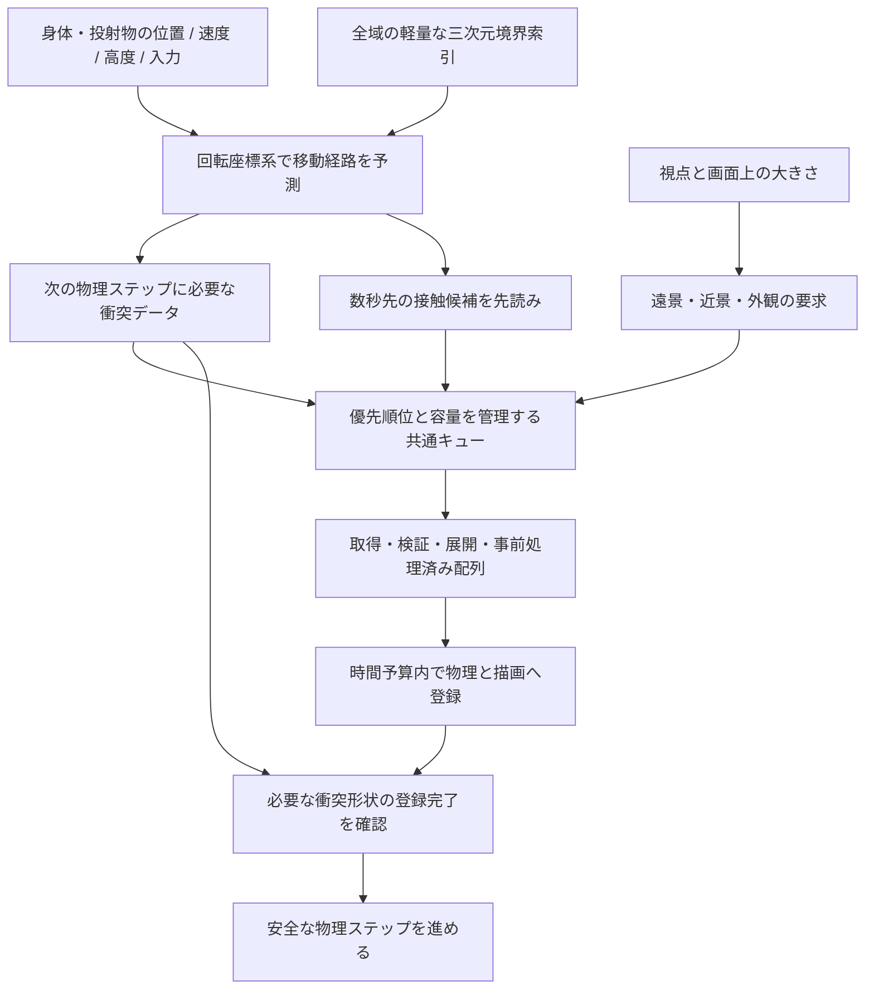

# 高速飛行を止めない東京三帯ストリーミング

本人の依頼は「Loading nearby streetsをもっとスムーズに、アーキテクチャレベルで検討」。
特に飛行・高速移動中が問題との回答。2026-09-25、本人が「ゴールに設定して実施して」と承認。
今回の到達点は、連続120秒の飛行・旋回・降下で先読み不足による停止0回、かつ床・壁の衝突を維持すること。
必須データが本当に欠ける場合の安全停止は残し、遅延・失敗・再訪・PC/WebXRを検査する。
アプリのゴール登録は以前の未完了ゴールと競合して拒否されたため、この文書を今回の作業目標とする。
旧長期ゴールの完了を意味しない。以下の調査は変更前の実測であり、新方式の検証結果とは分ける。

## 結論

読み込み量の調整に先立ち、**先読みの完了と、そのフレームを安全に進められる条件を分離する**。
現行の約256mの周辺区画は「欲しい」だけでも全件必須になり、一件でも未着なら世界の時刻を止める。
高度も判定に入らず、衝突し得ない空中移動でも真下の詳細を待つ。
飛行経路と地形・建物の三次元境界から接触までの時間を求め、必要な順に供給する設計へ移す。

## 現行コードで確認したこと

| 場所 | 挙動 | 意味 |
|---|---|---|
| `src/app/main.ts` regional foci | 現在点と原則1フレーム後の点へ約256mの円を要求。高度なし | 秒単位の先読みではない |
| `metroCollision.ts` request/refresh | wanted全件がresidentになるまでfalse | 新しい遠方タイルも即座に移動の必須条件 |
| `colonyMotionGate.ts` → main | falseならdeltaSeconds=0、プレイヤー・物理・回転基準・鉄道等を止める | 表示文言だけでなく実際に進行が止まる |
| MetroCollisionの退出 | 範囲を出ると即解放/abort。入退出の別閾値・短期保持なし | 境界の揺れや折返しで再取得 |
| MetroCollisionの選択 | 10,200区画を毎フレーム走査。load順はcatalog順 | 必要度順ではなく、固定費も毎フレーム発生 |
| 衝突のload | 描画用nearバイナリを別にfetch/展開し、三角形を20m付近の群へ実行時再編成 | 描画と要求・寿命・作業重複を調停する層がない |
| 描画 | 三帯それぞれnear/far/facadeが独立したキュー。円筒変形・細分化・外観構築は同期 | 取得の同時数だけではCPU/GPU反映負荷を制限できない |
| 初期準備 | 三帯全overview・樹木までloadVisuals完了しないとprepareRegionsがreadyにならない | 着地点と関係ない遠景が初回到着を遅らせ得る |
| プレビュー配信 | no-cache、独自配信部分はETag/条件付き304処理なし | 内容不変でも再要求が往復し、アプリ内展開も再実行 |

`getCityGroundHeight`やRapierが未読込を空地として扱う状態へ戻してはいけない。
現在の停止はその事故を避ける措置。読み込み対象と必須対象を分ける際も、衝突可能な全形状を
取得・検証・物理系へ登録し終わるまでは、その区間を進めないという条件を維持する。

## 実測（2026-09-24、固定build、実ブラウザー）

証拠: `/Volumes/BLAZE/Spinward/inland-b-20260924/streaming-architecture-20260924/baseline/`。
計器: `qa/plateau/metro-streaming-profile.mjs`。配信コードの準備判定を変更せず、request/load/reindexを
計測で包み、rAF、50ms以上のLong Task、HTTP要求、readiness遷移を記録した。
Chrome headless、1280×960、DPR1、Quest設定、ローカルBLAZE配信。外部analyticsのみrouteで遮断。
Playwright routeによるHTTPキャッシュ無効化の影響があり、ネットワークの再訪性能の一般値にはしない。

| 30秒の操作 | 停止回数 | 合計の準備待ち | 1停止の中央値 | 要求範囲計算のp95 |
|---|---:|---:|---:|---:|
| ダッシュ | 5 | 205ms | 41.0ms | 1.5ms/回 |
| 離陸→前進→着地 | 16 | 449ms | 23.6ms | 1.8ms/回 |
| 長い上昇→前進 | 25 | 526ms | 17.5ms | 1.8ms/回 |

- 未着タイルの地表方向距離は252.9〜256.3m程度。これらが加わった時点で停止した。
- 長い上昇の25停止中21件では、本人の高度が未着区画の建物/地形上端より100m以上高い。
  この標本は終盤に港端より外へ出るため、30秒全てをコロニー内巡航の性能と呼ばない。
- 離陸→着地の標本で、同じ `/west/tiles/5-199.bin.gz` を5回要求。
  1フレーム分の安全半径が変動すると、境界のwantedが出入りすることも確認した。
- 衝突fetch＋展開の中央値は約10〜18ms、最大約27ms。reindex最大0.6ms。
  操作中の50ms以上のLong Taskは0。この標本は「Workerへ移せば主因が消える」を支持しない。
  16ms前後のフレーム予算を超える小さな処理束や、ほかの地区のスパイクを否定する計測ではない。
- ログのspeedは慣性速度で共回転分を含む。先読み距離にそのまま使わない。
  移動の停止とCPU/GPUによるフレーム落ちは別の指標として評価する。

## 目標アーキテクチャ

### 1. 接触判定と先読みを分ける（最初のインクリメント）

Metro専用の要求を `critical` / `prefetch` / `retain` に分ける。
`prepareRegions`の真偽はcriticalの登録状態だけで決め、prefetchの不足/失敗は準備待ち画面にしない。
既存の他プリセットには従来のRegionalReadinessを維持する。

- **critical**: 身体・車両・投射物が次の物理ステップに通る体積と安全余裕。
  始点と終点だけでなく、間の経路、身体半径、最大dt、加速度、回転、物理サブステップを含める。
  地上の固定64m等を正式な安全条件にしない。既存Rapier登録範囲とも一致させる。
- **prefetch**: 同じ運動から数秒先まで予測した経路の周囲。取得＋展開＋登録のp95遅延を使い、
  最低の予測時間と旋回/加速の余裕を持たせる。2〜3秒は試験の初期値で、決定済み定数ではない。
  同速でも高度・降下速度で期限が異なる。高空では遠景を優先し、降下に合わせて衝突データを前倒しする。
- **retain**: 読込済みの周囲/背後を容量内で短期保持。ロード半径と解放半径を分け、
  往復・旋回・フレーム間の閾値の揺れでabort/再取得しない。LRUと世代番号で寿命を管理する。
- 一部が未着でも、criticalが全て物理登録済みなら飛び続ける。criticalが本当に未着の場合は
  現在の回転・身体・物理の整合した停止を最後の手段として残す。
  単に一つの身体だけ止めて回転世界を進めると、床が身体の下を移動するので採らない。

### 2. 高度を含む空間索引と期限順の要求

各タイルの元のboundsは所有セルを越える建物も含み、heightRangeも既にある。
これらを半径・帯角度へ変換した保守的な三次元境界で索引化する。
200mセルの所属番号だけで建物を検索すると、越境した建物を落とすので避ける。

全区画の総走査をやめ、移動体積/予測経路と交差する候補だけを更新する。
空中の身体から接触し得ない地表タイルはcriticalにしない。軸付近で地表投影が大きく動く場合も、
三次元の距離で判定する。ポート・端面・船体など常駐構造の衝突系は維持する。

優先順位は「今必要な衝突/着地面→接触期限が近い予測先→見える近景→外観/遠景」。
先読みだけで予算を使い切らず、critical用の取得枠・登録時間・メモリを予約する。
待ち行列・展開中・常駐・GPU入力を分けて計上し、不要な先読みは予算超過時に落とす。
criticalの過剰要求は不足を隠さず、停止の理由として返す。

### 3. 配信の形と実行時の作業を整理する

共通のデータ取得層で同じ資産への同時要求を束ねる。利用者が残る間は、一つのLODの退出だけで
共有要求をabortしない。異なる世代の遅い応答は破棄し、全バッファの所有者と解放を決める。

現行バイナリの共有を移行の足場とし、最終的には用途を分ける。

- **衝突用**: 不要な色・描画属性を省き、現在と同じ原典三角形の分割・空間索引を事前生成。
  粗い地形を本来の着地点として使い、後から高度を跳ねさせる方法は採らない。
- **描画用**: 固定半径での円筒分割、外観インスタンス配置など固定計算を生成段階へ移す。
  まずスパイクと容量増を測り、全10,200タイルの再生成は形式が固まってから実行する。
- **実行時**: 残る展開・検証・数値処理はWorkerで行い、配列を転送。
  メインスレッドは物理/GPUへの登録をフレームの時間予算内に分ける。
  Workerを使ってもGPUアップロードとRapier登録は自動的には無料にならず、
  転送済み/展開済みを衝突準備完了と取り違えない。

[Workerは別スレッドで実行できる](https://developer.mozilla.org/en-US/docs/Web/API/Web_Workers_API/Using_web_workers)。
[ArrayBufferのtransferは所有権を移し元を利用不能にする](https://developer.mozilla.org/en-US/docs/Web/API/Web_Workers_API/Transferable_objects)
ので、描画が使っている共有バッファをそのまま転送しない。

### 4. 再訪と初回到着を別に改善する

- タイルURLをdataset版/内容hashで固定し、不変資産を長期HTTPキャッシュへ。
  可変manifestは検証付きの短いキャッシュ。必要な場合だけ予算付き永続キャッシュを追加する。
  [内容更新でURLを変える資産はimmutableにできる](https://developer.mozilla.org/en-US/docs/Web/HTTP/Guides/Caching)。
  現行の可変URLへimmutableだけ付ける変更はしない。
- 初回/場所移動は、選んだ到着点の衝突と最低限の見える地面が揃ったら開始し、他帯の遠景は後追い。
  `manifestReady` / `traversalReady` / `visualConverged` を分け、三帯全景の完了を足元に要求しない。
- 通常の背景読込にカードを出さず、表示対象は本当のcritical待ちだけ。
  短時間の表示遅延はちらつき防止に使えるが、物理停止を解消した証拠にはしない。

## 実装順と受け入れ

1. critical/prefetch/retainと3D候補選択を実装。既存形式と物理を保ち、まず飛行停止を減らす。
2. 共通キュー、優先度、要求の共有、予算、差分索引を整え、折返しの再取得と固定CPU費を減らす。
3. オフライン前処理/Worker/分割登録、版付きキャッシュ、初回到着の局所化を必要度順に進める。

最初の到達点は**読込対象区画が増えただけでは飛行が止まらず、着地/壁への接触は正しく保たれる**。
正式な速度域は回転系の相対速度で記録し、実測前に達成済みとはしない。

受け入れケース:

- ローカルの固定buildで、地上付近の飛行→高空巡航→降下→着地→180度折返しを連続120秒。
  初回到着後のprefetch不足による停止を0回にする。critical停止は理由と不足範囲を別集計。
- 冷えたキャッシュ/再訪、追加100ms・250ms遅延、低帯域、通信失敗、急旋回、急加速、
  高速落下、屋上、負標高の地面、帯の端、軸付近、投射物を検査する。
- 身体が未登録の衝突範囲に侵入しない。床抜け・壁抜け・後からの地面の跳ね上がりを0にする。
  予測が外れて間に合わない時は欠落を空地にせず、停止・再試行・別地点への復帰が機能する。
- 一定の経路往復でメモリが上限内で安定し、遅い結果が退去済み地域を復活させない。
- 停止回数/総停止時間/最大停止時間、接触準備の遅延、再取得/abort、メインスレッド登録時間を測る。
- PCとplaywright-webxr 0.3.0の実VR入口で確認。エミュレーションと実HMDは別扱い。
  既存のHUD、手首操作、身体、他プリセット切替、港側の地理配置を維持する。

読み込みには有限の時間があるので、任意の速度・任意の遅い通信で「絶対に待たない」は約束しない。
通常の連続飛行を予測によって滑らかにし、本当に安全が確認できない場合だけ待つ設計とする。

## 実装状況（2026-09-25）

最初のインクリメントを実装。衝突の必須範囲・先読み・短期保持を分けた。

- `regionalMotion.ts`: 身体と投射物の回転座標系での位置・相対速度・加速度上限・半径を渡す。
  既存プリセットは従来のfocus契約を保ち、場所移動の到着点は先読みとは別に必須扱い。
- `metroStreaming.ts`: タイル全体の三次元境界（所有セルを越える建物、高さ、円筒の極値を含む）を
  起動時にBVHへ登録。criticalは次のdtの移動全体を含む保守的体積、prefetchは3秒先までの
  共回転を除いた慣性移動と加速余裕。中間区間も覆い、始点/終点だけの穴を作らない。
- `metroCollision.ts`: criticalだけが世界の進行条件。接触期限順に取得し、背景取得は同時2件まで、
  残り1枠を急な必須要求用に残す。容量内で8秒保持し、critical優先で背景を退去。
  遅い応答の世代/abort確認と、失敗の再試行を維持。通常フレームは全10,200件を走査しない。
- 衝突三角形・負標高・回転物理は原典のまま。Rapierへ登録する周辺範囲にもフレームの移動量を反映。
  準備不足時の世界全体の一貫した停止は残す。単にカードを消したりreadyを偽装していない。
- 衝突キャッシュ上限は96タイル、元の配列48MiB相当、展開済み衝突配列144MiB。
  これはGPUやRapier内部メモリを含むアプリ総メモリの値ではない。

証跡は `/Volumes/BLAZE/Spinward/inland-b-20260924/streaming-20260925/`。
固定候補buildは `main-dist`。`profile-initial` と `profile-slow` は大宮からの実キー操作120秒、
離陸・旋回・降下を3回。通常と250ms遅延＋1MiB/s帯域の両方で停止0回、3回地上復帰、abort 0回。
通常の相対速度は最大117.4m/s、高度は最大319.8m、港端外へは出ていない。
要求計算p95は0.1ms、通常の常駐衝突配列ピーク8.46MB。別経路の旧30秒測定p95 1.8msとは
標本を区別する。測定のHTTPキャッシュはPlaywright routeの影響を受ける。

`faults` は必須データの取得を実ブラウザーで失敗させた結果。18件の失敗を経て安全停止し、
入力中も身体位置と世界の回転角が不変、再試行と元の地面への復帰を確認した。
関連30単体テストは成功。原典地面への高速落下は三帯、壁接触は100m/sで検査。
任意速度の衝突保証は含めない。既存の物理サブステップには64段の上限が残る。

独立画像検証では地面の大穴・床下視点・読込カードの遮蔽は見つからなかった。
中距離の建物LODの密度境界、暗い路面、瞬間的なフレーム時間の増加は残る。
初期到着の短縮、描画との取得共有、オフライン衝突形式、Worker移行、版付きHTTPキャッシュは
本インクリメントでは未実装。これらまで完成したという報告にはしない。

PC/WebXR 0.3.0 の固定ビルド受入は11/11成功（`browser-final`、`browser-report.json`）。
地理配置、三帯の原典地面への接地、負標高、VRの身体・手首・プリセット往復・ハードウェア表示を含む。
実HMDでの検査は未実施。

全体Bun実行は1232成功・6時間切れで、無条件の全件成功とはしない。
時間切れの6件を単独検証すると5件は既定時間内に成功、残る従来のmotorway parapet検査は
既定5秒を超える約18秒の幾何検査だった。コードを変更せずCLIの制限を60秒にして機能成功を確認。
関連するMetroとgateの30件は通常設定で成功した。
